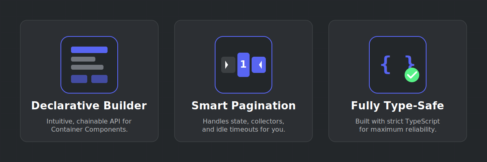

<p align="center">
  
</p>

<h3 align="center">Streamline your Discord UI with declarative Containers & Stateful Pagination.</h3>

<p align="center">
  <a href="https://github.com/rly-dev/InteractiveFlow/actions"></a>
  <a href="https://www.npmjs.com/package/interactiveflow"></a>
  <a href="https://www.npmjs.com/package/interactiveflow"></a>
  <a href="LICENSE"></a>
  <a href="https://discord.js.org"></a>
</p>

<p align="center">
  <a href="#-features">Features</a> •
  <a href="#-installation">Installation</a> •
  <a href="#-quick-start">Quick Start</a> •
  <a href="#-api-reference">API</a> •
  <a href="#-examples">Examples</a> •
  <a href="#-contributing">Contributing</a> •
  <a href="#-license">License</a>
</p>

---

## ✨ Features

<p align="center">
  
</p>

- **🧱 Declarative Container Builder** — Fluent, chainable API wrapping `ContainerBuilder` for clean, readable layouts.
- **📄 Stateful Pagination Engine** — Generic `FlowPaginator<T>` that handles collectors, timeouts, and navigation automatically.
- **🔒 Fully Type-Safe** — Written in strict TypeScript with comprehensive JSDoc coverage on every public member.
- **📦 Dual Output** — Ships ESM and CJS bundles via tsup with full declaration files.
- **⚡ Validation Built-In** — Checks Discord's component limits at build time with descriptive `FlowError` messages.
- **🎯 Zero Config Pagination** — Just provide your data, a render function, and call `send()`. Everything else is handled.

---

## 📦 Installation

```bash
npm install interactiveflow
```

```bash
# or with your preferred package manager
yarn add interactiveflow
pnpm add interactiveflow
```

> **Peer Dependency:** Requires [`discord.js`](https://discord.js.org) v14 or higher.

---

## 🚀 Quick Start

### Building a Static Container

Create a Components V2 container in just a few lines:

```ts
import { FlowContainer } from "interactiveflow";
import { ButtonBuilder, ButtonStyle, MessageFlags } from "discord.js";

const card = new FlowContainer({ accentColor: 0x5865f2 })
  .addTitle("# 📋 Server Info")
  .addSeparator()
  .addDescription("Welcome to the server! Here's what we offer.")
  .addSection({
    content: "🔗 **Website**\nCheck out our homepage for updates.",
    buttonAccessory: new ButtonBuilder()
      .setLabel("Visit")
      .setStyle(ButtonStyle.Link)
      .setURL("https://example.com"),
  });

await interaction.reply({
  components: [card.toBuilder()],
  flags: MessageFlags.IsComponentsV2,
});
```

### Paginated Lists

Turn any array into a navigable, paginated view with one class:

```ts
import { FlowContainer, FlowPaginator } from "interactiveflow";

const users = ["Alice", "Bob", "Charlie", "Dave", "Eve", "Frank", "Grace"];

const paginator = new FlowPaginator<string>({
  data: users,
  pageSize: 3,
  idleTimeout: 30_000,
  render: (items, pageIndex, totalPages) => {
    const list = items
      .map((name, i) => `**${pageIndex * 3 + i + 1}.** ${name}`)
      .join("\n");

    return new FlowContainer({ accentColor: 0x57f287 })
      .addTitle("# 👥 User Directory")
      .addSeparator()
      .addDescription(list);
  },
});

await paginator.send(interaction);
```

The paginator automatically handles:
- ◀ **Previous** / **Page X/Y** / **Next** ▶ navigation buttons
- Filtering interactions to the original user
- Disabling buttons and cleaning up after the idle timeout

---

## 📖 API Reference

### `FlowContainer`

A declarative wrapper around Discord.js `ContainerBuilder`.

#### Constructor

```ts
new FlowContainer(options?: FlowContainerOptions)
```

| Option | Type | Description |
|---|---|---|
| `accentColor` | `number` | Accent color for the container sidebar. |
| `spoiler` | `boolean` | Whether to render as a spoiler. |

#### Methods

| Method | Returns | Description |
|---|---|---|
| `.addTitle(text)` | `this` | Add a title text display (supports markdown). |
| `.addDescription(text)` | `this` | Add a description text display. |
| `.addSeparator(options?)` | `this` | Add a separator. Options: `{ divider?: boolean, spacing?: "small" \| "large" }` |
| `.addSection(options)` | `this` | Add a section with text + an optional `buttonAccessory` or `thumbnailAccessory`. |
| `.addActionRow(...components)` | `this` | Add an action row with interactive components. |
| `.addComponent(component)` | `this` | Escape hatch — add any raw discord.js container component. |
| `.setAccentColor(color)` | `this` | Set the container accent color. |
| `.setSpoiler(spoiler)` | `this` | Toggle the spoiler flag. |
| `.getComponentCount()` | `number` | Current number of top-level components. |
| `.getRemainingCapacity()` | `number` | Remaining slots before Discord's 10-component limit. |
| `.toBuilder()` | `ContainerBuilder` | Access the underlying discord.js builder. |
| `.build()` | `APIContainerComponent` | Serialize to API-ready JSON. |

> All mutating methods return `this` for chaining.

---

### `FlowPaginator<T>`

A generic, stateful pagination engine.

#### Constructor

```ts
new FlowPaginator<T>(options: FlowPaginatorOptions<T>)
```

| Option | Type | Default | Description |
|---|---|---|---|
| `data` | `T[]` | — | The full dataset to paginate. |
| `pageSize` | `number` | `5` | Items per page. |
| `render` | `FlowPageRenderer<T>` | — | Function receiving `(items, pageIndex, totalPages)` → `FlowContainer`. |
| `idleTimeout` | `number` | `60000` | Collector idle timeout in ms. |

#### Methods & Properties

| Member | Type | Description |
|---|---|---|
| `.totalPages` | `number` | Total number of pages (getter). |
| `.getState()` | `PaginatorState` | Snapshot: `{ currentPage, totalPages, active }`. |
| `.getPageData()` | `T[]` | Data slice for the current page. |
| `.renderPage(disabled?)` | `object` | Render current page with nav buttons. |
| `.send(target)` | `Promise<Message>` | Send to a channel or reply to an interaction. Starts the collector. |
| `.stop()` | `void` | Manually stop the collector and disable buttons. |

---

### `FlowError`

Custom error class with a `code` property for structured error handling.

```ts
try {
  container.addTitle("...");
} catch (error) {
  if (error instanceof FlowError && error.code === "COMPONENT_LIMIT") {
    console.log("Too many components!");
  }
}
```

| Error Code | Source | Description |
|---|---|---|
| `COMPONENT_LIMIT` | FlowContainer | Container exceeds 10 components. |
| `INVALID_SECTION` | FlowContainer | Section has both button + thumbnail accessory. |
| `EMPTY_DATA` | FlowPaginator | Data array is empty. |
| `INVALID_PAGE_SIZE` | FlowPaginator | Page size is less than 1. |
| `INVALID_TARGET` | FlowPaginator | Unsupported send target. |

---

### Constants

| Constant | Value | Description |
|---|---|---|
| `MAX_CONTAINER_COMPONENTS` | `10` | Max top-level components per container. |
| `MAX_SECTION_TEXT_COMPONENTS` | `3` | Max text items in a section. |
| `MAX_ACTION_ROW_COMPONENTS` | `5` | Max items in an action row. |
| `DEFAULT_PAGE_SIZE` | `5` | Default items per page. |
| `DEFAULT_IDLE_TIMEOUT` | `60000` | Default idle timeout (ms). |

---

## 📂 Examples

See the [`examples/`](examples/) directory for complete, runnable demos:

- **[`basic-usage.ts`](examples/basic-usage.ts)** — Static info card + paginated user directory.

---

## 🛠️ Development

```bash
# Install dependencies
npm install

# Build (ESM + CJS)
npm run build

# Watch mode
npm run dev

# Type-check
npm run lint
```

---

## 🤝 Contributing

Contributions are welcome! Please read our [**Contributing Guide**](CONTRIBUTING.md) and [**Code of Conduct**](CODE_OF_CONDUCT.md) before getting started.

---

## 👤 Credits

Built and maintained by [**rly-dev**](https://github.com/rly-dev).

---

## 📄 License

This project is licensed under the [**GNU General Public License v3.0**](LICENSE).
